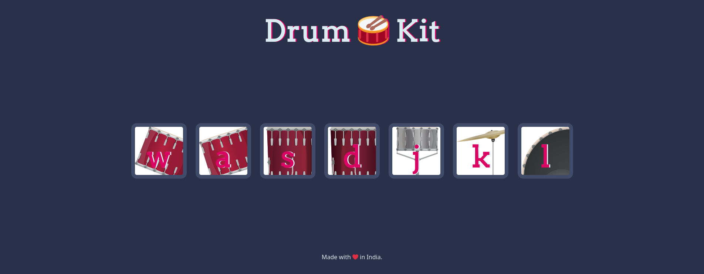

## Welcome to the Drum Kit

This is a demo of using JavaScript's **Event Listener** functionalities falling under Angela Yu's [Full Stack Development Course](https://www.udemy.com/course/the-complete-web-development-bootcamp)

# 

We are initialising the audio in each switch case because a single audio cannot be playing in multiple instances. Therefore the program will wait for the audio to end playing before it plays another audio had it been initialised at the start of the program

## Things I learnt :
* How to play audio using JavaScript
* The Document Object Model (DOM)
* Adding and Removing classes using JavaScript
* Animating Objects using CSS & JS
* Capturing buttons presses and mouse clicks  
#

## This : 
```js
switch (key) {
        case 'w':
            var tom1 = new Audio('sounds/tom-1.mp3');
            tom1.play();
            break;
```
## Instead of this : 
```js
var tom1 = new Audio('sounds/tom-1.mp3');
switch (key) {
        case 'w':
            tom1.play();
            break;
```
`You don't really want to wait for the audio to stop playing before you hit another drum, do you?`
#

### Resources :
* [Angela Yu - Complete Web Development Bootcamp on Udemy](https://www.udemy.com/course/the-complete-web-development-bootcamp)
* [MDN Docs - Events](https://developer.mozilla.org/en-US/docs/Web/API/Events)
* [MDN Docs - KeyboardEvent](https://developer.mozilla.org/en-US/docs/Web/API/KeyboardEvent)
* [MDN Docs - keydown](https://developer.mozilla.org/en-US/docs/Web/API/Element/keydown_event)  